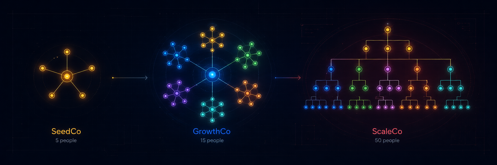

# agent-crew

> *"It doesn't make sense to hire smart people and tell them what to do; we hire smart people so they can tell us what to do."* — Steve Jobs

A collection of **agent profiles** organized as three startups at three stages. Pick a stage that fits your crew size, browse the roles, and drop the personas into any agent harness.

## The three companies

| Stage | Headcount | Description |
|---|---|---|
| **[SeedCo](stages/seed-co.md)** → [profiles](seed-co/) | ~5 people | The garage. Survival mode. Everyone wears two hats. Pre-product-market fit. |
| **[GrowthCo](stages/growth-co.md)** → [profiles](growth-co/) | ~15 people | The engine. Functional departments forming. No management layers yet. |
| **[ScaleCo](stages/scale-co.md)** → [profiles](scale-co/) | ~50 people | The machine. PMF established. Management layers and exec team. |

Each profile has a **SOUL.md** (full persona: voice, principles, what they push back on, how they research) and a **README.md** (quick overview: when to use, problems they solve, warning signs).

Every profile has **strong conviction** — they push back on bad ideas, challenge assumptions, and argue for the best solution. Not the easiest one.

## How to use

1. **Pick your stage** — how many people are in your crew? Start with the corresponding stage doc to see the org chart and dynamics.
2. **Pick your roles** — browse the profiles at that stage. You don't need all of them. A solo founder starts with 2-3 roles from SeedCo. A growing team adds from GrowthCo.
3. **Drop into your harness** — adapt the persona format to your agent system (CrewAI, AutoGen, LangGraph, custom, etc.). Harness-agnostic by design.

## Quick reference

| I need… | Start here |
|---|---|
| A complete org for a tiny team | [SeedCo stage →](stages/seed-co.md) then [browse profiles →](seed-co/) |
| A scaling startup with departments | [GrowthCo stage →](stages/growth-co.md) then [browse profiles →](growth-co/) |
| An org with management layers | [ScaleCo stage →](stages/scale-co.md) then [browse profiles →](scale-co/) |
| Cross-team workflows and processes | [Interactions →](interactions/) |
| All profiles in one JSON index | [profiles.json →](profiles.json) |

## Getting started

This repo is a product, not just a collection of files. If you're a paying client, start here:

| Guide | What it covers |
|---|---|
| [📖 Start Here](docs/start-here.md) | Your first 30 minutes — pick a stage, read profiles, run your first crew |
| [🔌 Integration Guide](docs/integration-guide.md) | Hook profiles into CrewAI, AutoGen, LangGraph, or custom harnesses |
| [🔧 Customization Guide](docs/customization-guide.md) | Rename personas, adjust tone, add roles, adapt to your industry |

## What makes these profiles different

Most agent profiles are task descriptions — "you are an AI assistant that helps with X." These are **personas** with the depth and flaws of real colleagues:

- **They push back.** Each profile has a "what they push back on" section that defines when and how they disagree. These agents don't say "yes" to everything.
- **They research.** Every profile has a defined research methodology. They don't guess — they look things up.
- **They have stage-appropriate tendencies.** SeedCo profiles are more conservative with resources. ScaleCo profiles think in systems and process.
- **They're built for multi-agent tension.** A CEO who always agrees with the CTO isn't useful. These profiles are designed to create productive friction.

## Design philosophy

- **Every profile pushes back** — challenges assumptions, offers reasoned advice, argues for the best solution
- **Every profile researches** — looks things up before forming opinions
- **Stage-appropriate tendencies** — SeedCo profiles are more resource-conservative; ScaleCo profiles are more systems-oriented
- **Harness-agnostic** — no platform-specific config, API keys, or runtime paths
- **MIT licensed** — use, adapt, remix, ship

## License

MIT — use, adapt, remix, ship. Attribution appreciated but not required.

---

*"The people who are crazy enough to think they can change the world are the ones who do."* — Steve Jobs

---

> **Educational & reference notice.** This repository contains fictional agent personas, company structures, and workflows designed for learning, experimentation, and reference. Any resemblance to real persons, companies, or organizations is coincidental. The profiles are templates — adapt them to your specific context, industry, and compliance requirements before deploying in production or client-facing environments.
