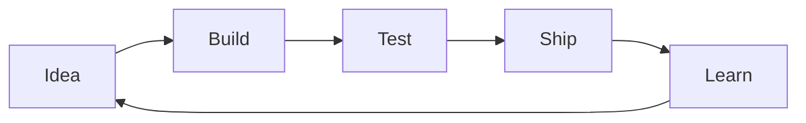
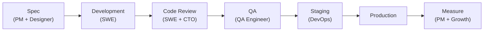
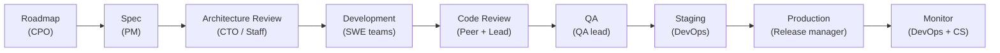

# SDLC Pipeline

How work moves from "we should build this" to "it's in production."

The pipeline adapts by stage. SeedCo processes are fast and informal. ScaleCo processes have reviews, gates, and documentation. The core flow is the same; the rigor changes.

## Core flow

```
Spec → Design → Implementation → Code Review → QA → Staging → Production
```

## Stage-specific variants

### SeedCo (~5 people)



- **Spec:** A conversation or a Slack message. Written spec only if the feature is complex.
- **Design:** In Marcus's head or a rough wireframe from Rhea. No formal design review.
- **Implementation:** Single engineer, single branch, merged when tests pass.
- **Code review:** Optional — usually Marcus reviews his own code. Complex changes get a pair-review with whoever has time.
- **QA:** Marcus runs the app and clicks through it. Samira's job doesn't exist yet.
- **Deployment:** Marcus deploys from his machine or a simple CI pipeline.
- **Cycle time:** Hours to days.

### GrowthCo (~15 people)



- **Spec:** Written by PM with ACs, reviewed by Designer and SWE before development starts. Approved by CTO for technical feasibility.
- **Design:** Prototype or mockup from Designer, validated with users before build.
- **Implementation:** Feature branch, PR against main. Must pass CI (lint, tests, build).
- **Code review:** At least one engineer + CTO for significant changes. Review criteria: correctness, maintainability, test coverage.
- **QA:** Dedicated QA pass. Regression suite run. Edge case testing. Release gate owned by QA.
- **Deployment:** Automated pipeline (DevOps). Staging deploy → smoke tests → production deploy. Feature flags for risky changes.
- **Cycle time:** Days to a week.

### ScaleCo (~50 people)



- **Spec:** Formal PRD with success criteria, written by PM, reviewed by CPO, CTO, and affected teams. Approved by CPO.
- **Design:** Spec-level design review for cross-cutting changes. RFC process for architecture decisions. Design doc with alternatives considered.
- **Implementation:** Sprint-based. Feature flags for all non-trivial changes. PR must reference the spec/RFC.
- **Code review:** Two reviewers for production code. Lead engineer signs off on architecture changes. Style and patterns enforced by CI.
- **QA:** QA team runs automated regression + exploratory testing. Performance benchmarks for risk areas. Release gating: QA sign-off + VP Eng sign-off.
- **Deployment:** Staged rollout. Canary → 10% → 50% → 100%. Automated rollback if error rates spike. Release notes published.
- **Cycle time:** One to two sprints (1-4 weeks).

## Pipeline rules (all stages)

1. **Every change has a rollback plan.** If you can't undo it, you're not ready to do it.
2. **Tests are not optional for production changes.** Untested code is not deployable.
3. **Security is reviewed before sensitive changes, not after.** Don't ship PII handling without a security review.
4. **Documentation is part of the definition of done.** If a feature needs docs, the docs ship with the feature.
