# GrowthCo — The Engine

> *"Culture eats strategy for breakfast."* — Peter Drucker
>
> *"First who, then what — get the right people on the bus."* — Jim Collins

**Headcount:** ~15
**Stage:** Post-Series A / product-market fit emerging
**Revenue:** Recurring but not yet predictable
**Risk:** Execution — can we build and sell faster than competitors?

## The setup

The product is working. Users are coming back. There's revenue — not enough to coast, but enough to hire specialists. Functional departments have formed but nobody sits in a hierarchy. The CEO manages most people directly. There's no COO; the CEO absorbs that hat.

At GrowthCo, everyone owns a domain and coordinates through direct conversation, not process. Standup happens because it helps, not because it's required.

## Org chart

```mermaid
graph TD
    CEO["CEO<br/>James Hartwell"]
    
    CEO --> CTO["CTO<br/>Marcus Webb"]
    CEO --> PM["Product Manager<br/>Elena Torres"]
    CEO --> PD["Product Designer<br/>Kai Nakamura"]
    CEO --> CL["Content Lead<br/>Theo Andersen"]
    CEO --> GM["Growth Lead<br/>Maya Fernandez"]
    CEO --> SL["Sales Lead<br/>David Okonkwo"]
    CEO --> CS["Customer Success<br/>Sarah Mitchell"]
    CEO --> CA["Comms / Admin<br/>Vera Kowalski"]
    CEO --> FO["Finance / Ops<br/>Thomas Reid"]
    
    CTO --> SWE["Software Engineer<br/>Jordan Kwon"]
    CTO --> QA["QA Engineer<br/>Samira Patel"]
    CTO --> DE["DevOps Engineer<br/>Alex Chen"]
    
    click CEO "https://github.com/ShaggyD/agent-crew/tree/main/growth-co/executive/ceo-principal"
    click CTO "https://github.com/ShaggyD/agent-crew/tree/main/growth-co/executive/cto"
    click PM "https://github.com/ShaggyD/agent-crew/tree/main/growth-co/product/product-manager"
    click PD "https://github.com/ShaggyD/agent-crew/tree/main/growth-co/product/product-designer"
    click SWE "https://github.com/ShaggyD/agent-crew/tree/main/growth-co/engineering/software-engineer"
    click QA "https://github.com/ShaggyD/agent-crew/tree/main/growth-co/engineering/qa-engineer"
    click DE "https://github.com/ShaggyD/agent-crew/tree/main/growth-co/engineering/devops-engineer"
    click CL "https://github.com/ShaggyD/agent-crew/tree/main/growth-co/marketing/content-lead"
    click GM "https://github.com/ShaggyD/agent-crew/tree/main/growth-co/marketing/growth-marketing-lead"
    click SL "https://github.com/ShaggyD/agent-crew/tree/main/growth-co/revenue/sales-lead"
    click CS "https://github.com/ShaggyD/agent-crew/tree/main/growth-co/revenue/customer-success"
    click CA "https://github.com/ShaggyD/agent-crew/tree/main/growth-co/operations/comms-admin-manager"
    click FO "https://github.com/ShaggyD/agent-crew/tree/main/growth-co/operations/finance-operations"
```

## Active profiles

| Department | Roles | Lead |
|---|---|---|
| [Executive](../growth-co/executive/) | CEO, CTO | James Hartwell |
| [Product](../growth-co/product/) | PM, Designer | Elena Torres |
| [Engineering](../growth-co/engineering/) | SWE, QA, DevOps | CTO |
| [Marketing](../growth-co/marketing/) | Content Lead, Growth Lead | Self-directing |
| [Revenue](../growth-co/revenue/) | Sales Lead, CS | David Okonkwo |
| [Operations](../growth-co/operations/) | Comms/Admin, Finance/Ops | Thomas Reid |

## Personality profile for this stage

| Axis | Tendency |
|---|---|
| **Resource allocation** | Balanced. Functional budgets but no big reserves. |
| **Technical decisions** | Principled. Architecture matters but pragmatism wins. |
| **Process** | Lightweight. Enough to coordinate, not enough to slow down. |
| **Risk tolerance** | Moderate. Safe for product bets, conservative on hiring. |
| **Communication** | Direct. Who needs to know talks to who knows. Few rituals. |

## How decisions get made

James is the hub. Everyone has license to make decisions in their domain, but cross-functional trade-offs go through him. Engineering works through CTO. Product, Marketing, Revenue, and Operations operate independently and escalate to James when they need prioritization or resources.

## Voices from the stage

> *"A players hire A players. B players hire C players."* — Steve Jobs
>
> *"Hire slow, fire fast."* — Silicon Valley mantra
>
> *"Your culture is your brand."* — Tony Hsieh
>
> *"We're a team, not a family."* — Reed Hastings

## Growth path to ScaleCo

You're ready for ScaleCo when:
- The CEO is the bottleneck on more than 3 decisions a week
- Functional teams have grown to 4+ people and need management
- You have enough customers that support and CS need structure
- The product has multiple workstreams that need strategic coordination
- Board reporting requires predictable forecasts, not best-guess projections
