# ScaleCo — The Machine

> *"We are stubborn on vision. We are flexible on details."* — Jeff Bezos
>
> *"Only the paranoid survive."* — Andy Grove

**Headcount:** ~50
**Stage:** Series B+ / product-market fit established
**Revenue:** Predictable enough to plan in quarters
**Risk:** Organizational — coordination costs and culture dilution

## The setup

The company works. The product sells. The question has shifted from "can we build this?" to "can we build it reliably, sell it predictably, and keep the best people from leaving?"

Management layers have emerged. The CEO no longer knows everyone's name. Decisions flow through the COO, who coordinates across functions. Each executive runs their department as a semi-autonomous unit with its own goals, budget, and processes.

## Org chart

```mermaid
graph TD
    CEO["CEO<br/>James Hartwell"]
    
    CEO --> COO["COO / Chief of Staff<br/>Priya Sharma"]
    CEO --> CTO["CTO<br/>Marcus Webb"]
    CEO --> CPO["Chief Product Officer<br/>Amara Obi"]
    CEO --> CMO["Chief Marketing Officer<br/>Dara Eze"]
    CEO --> VPS["VP Sales<br/>Marcus Chen"]
    CEO --> CFO["Chief Financial Officer<br/>Sarah Kellerman"]
    
    CTO --> SWE["Software Engineer<br/>Jordan Kwon"]
    CTO --> QA["QA Engineer<br/>Samira Patel"]
    CTO --> DE["DevOps Engineer<br/>Alex Chen"]
    
    CPO --> PM["Product Manager<br/>Elena Torres"]
    CPO --> PD["Product Designer<br/>Kai Nakamura"]
    
    CMO --> CL["Content Lead<br/>Theo Andersen"]
    CMO --> GM["Growth Lead<br/>Maya Fernandez"]
    
    VPS --> SL["Sales Lead<br/>David Okonkwo"]
    VPS --> CS["Customer Success<br/>Sarah Mitchell"]
    
    CFO --> FO["Finance / Ops<br/>Thomas Reid"]
    CFO --> CA["Comms / Admin<br/>Vera Kowalski"]
    
    click CEO "https://github.com/ShaggyD/agent-crew/tree/main/scale-co/executive/ceo-principal"
    click COO "https://github.com/ShaggyD/agent-crew/tree/main/scale-co/executive/coo-chief-of-staff"
    click CTO "https://github.com/ShaggyD/agent-crew/tree/main/growth-co/executive/cto"
    click CPO "https://github.com/ShaggyD/agent-crew/tree/main/scale-co/product/cpo"
    click CMO "https://github.com/ShaggyD/agent-crew/tree/main/scale-co/marketing/cmo"
    click VPS "https://github.com/ShaggyD/agent-crew/tree/main/scale-co/revenue/vp-sales"
    click CFO "https://github.com/ShaggyD/agent-crew/tree/main/scale-co/operations/cfo"
    click PM "https://github.com/ShaggyD/agent-crew/tree/main/growth-co/product/product-manager"
    click PD "https://github.com/ShaggyD/agent-crew/tree/main/growth-co/product/product-designer"
    click SWE "https://github.com/ShaggyD/agent-crew/tree/main/growth-co/engineering/software-engineer"
    click QA "https://github.com/ShaggyD/agent-crew/tree/main/growth-co/engineering/qa-engineer"
    click DE "https://github.com/ShaggyD/agent-crew/tree/main/growth-co/engineering/devops-engineer"
    click CL "https://github.com/ShaggyD/agent-crew/tree/main/growth-co/marketing/content-lead"
    click GM "https://github.com/ShaggyD/agent-crew/tree/main/growth-co/marketing/growth-marketing-lead"
    click SL "https://github.com/ShaggyD/agent-crew/tree/main/growth-co/revenue/sales-lead"
    click CS "https://github.com/ShaggyD/agent-crew/tree/main/growth-co/revenue/customer-success"
    click FO "https://github.com/ShaggyD/agent-crew/tree/main/growth-co/operations/finance-operations"
    click CA "https://github.com/ShaggyD/agent-crew/tree/main/growth-co/operations/comms-admin-manager"
```

## Active profiles

| Department | Executive | IC profiles |
|---|---|---|
| [Executive](../scale-co/executive/) | CEO, COO, CTO | — |
| [Product](../scale-co/product/) | CPO | PM, Designer (from GrowthCo) |
| [Engineering](../scale-co/engineering/) | CTO | SWE, QA, DevOps (from GrowthCo) |
| [Marketing](../scale-co/marketing/) | CMO | Content Lead, Growth Lead (from GrowthCo) |
| [Revenue](../scale-co/revenue/) | VP Sales | Sales Lead, CS (from GrowthCo) |
| [Operations](../scale-co/operations/) | CFO | Finance/Ops, Comms/Admin (from GrowthCo) |

## Personality profile for this stage

| Axis | Tendency |
|---|---|
| **Resource allocation** | Structured. Formal budgets with variance tracking. |
| **Technical decisions** | Systematic. Architecture reviews, RFCs, ADRs. |
| **Process** | Necessary. Process scales coordination but must justify its existence. |
| **Risk tolerance** | Low for operational risks, moderate for new market bets. |
| **Communication** | Structured. Executive staff meetings, functional standups, async by default. |

## How decisions get made

The executive team (CEO, COO, CTO, CPO, CMO, VP Sales, CFO) meets weekly for cross-functional decisions. Each executive runs their department with autonomy. The COO resolves inter-department conflicts. Escalation to the CEO is reserved for strategic direction changes, resource allocation above departmental authority, and existential issues.

Decisions are slower at ScaleCo but more durable. The cost of a wrong decision is higher, so the investment in getting it right is justified.

## Voices from the stage

> *"Disagree and commit."* — Jeff Bezos
>
> *"Let chaos reign, then rein in chaos."* — Andy Grove
>
> *"It remains Day 1."* — Jeff Bezos
>
> *"Good is the enemy of great."* — Jim Collins
>
> *"It doesn't make sense to hire smart people and tell them what to do; we hire smart people so they can tell us what to do."* — Steve Jobs

## Growth path beyond ScaleCo

Beyond 50 people, the next phase typically involves:
- Sub-departments within functions (e.g., multiple product teams reporting through PM directors)
- Regional or product-line divisional structures
- Dedicated People/HR leadership
- Legal and compliance as a stand-alone function
- Formal OKR or MBO cadence
