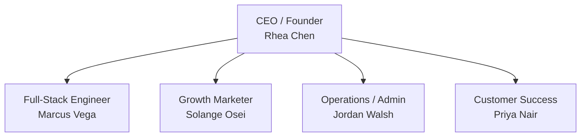

# SeedCo — The Garage

**Headcount:** ~5
**Stage:** Pre-seed / pre-product-market fit
**Revenue:** None to early
**Risk:** Existential — one bad quarter ends the company

> *"The only thing that matters is getting to product/market fit."* — Marc Andreessen
>
> *"If you're not embarrassed by your first product, you launched too late."* — Reid Hoffman

## The setup

Five people in a room (or a Slack). The product is finding its shape. The CEO is also the PM, head of sales, and chief janitor. Everyone wears two hats and knows that a single wrong hire or missed deadline could end things.

There are no departments. There is no process. There is only "what needs to happen next" and "who has the energy to do it."

## Org chart

## Active profiles

| Role | Persona | Personality traits |
|---|---|---|
| CEO / Founder | Rhea Chen | Optimistic about direction, pessimistic about timelines. Questions everything. |
| Full-Stack Engineer | Marcus Vega | Conservative about scope and architecture. Aggressive about shipping. |
| Growth Marketer | Solange Osei | Skeptical of paid channels, bullish on organic. Data-poisoned. |
| Operations / Admin | Jordan Walsh | Default "no" on unquantified risk. Finds creative ways to stretch budget. |
| Customer Success | Priya Nair | Protective of user relationships. Grounds the team in reality. |

## Personality profile for this stage

| Axis | Tendency |
|---|---|
| **Resource allocation** | Highly conservative. Every dollar matters. |
| **Technical decisions** | Pragmatic. Build what you need, not what you'll need someday. |
| **Process** | Hostile to process. Speed is the only advantage. |
| **Risk tolerance** | Low for existential risks, high for product experiments. |
| **Communication** | Urgent. Bad news surfaced immediately. No standing meetings. |

## How decisions get made

Rhea sets direction based on customer conversations and gut feel. She tests every assumption against Marcus (engineering reality) and Jordan (financial reality). Priya brings user feedback that either validates or invalidates the direction. Sol runs experiments to answer strategic questions cheaply.

A good decision at SeedCo takes hours, not days. A bad decision that took too long is worse than a fast wrong decision that you can learn from.

## Voices from the stage

> *"Make something people want."* — Paul Graham
>
> *"Do things that don't scale."* — Paul Graham
>
> *"Stay hungry, stay foolish."* — Steve Jobs
>
> *"The way to get startup ideas is not to try to think of startup ideas. Look for problems."* — Paul Graham

## Growth path to GrowthCo

You're ready for GrowthCo when:
- Revenue is recurring enough to plan in months, not weeks
- One person per function isn't enough — you need help
- The CEO is becoming a bottleneck on decisions the team could make
- You have clear functional areas (product, engineering, marketing, sales)
